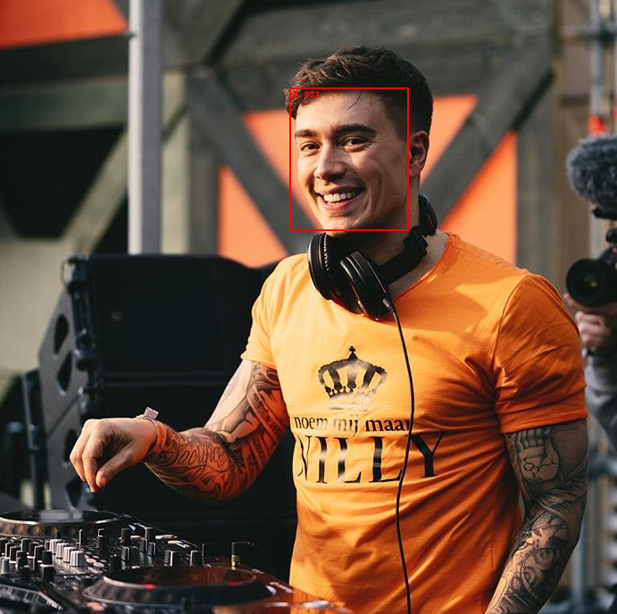

# Age-Gender-Prediction
Deep Learning 2022 Final Project: Face Detection with Age &amp; Gender Prediction

# Information
Face Detection Model Creation: Contains the code of the training and configuration of the YOLO v5 model.
 
Face Extraction: Visualization of the previous model returning a list of detected faces as images.
 
Age & Gender Prediction Model Creation: Contains the code of the training and configuration of the ResNet-18 model.
 
Face Detection: Age & Gender Detection: Final notebook encapsulating everything and working with images, videos and real-time webcams.

# Students
Joan Gracia 219176  
Pere Fraga 217065  
Josep Ricci 217020  

# Results

